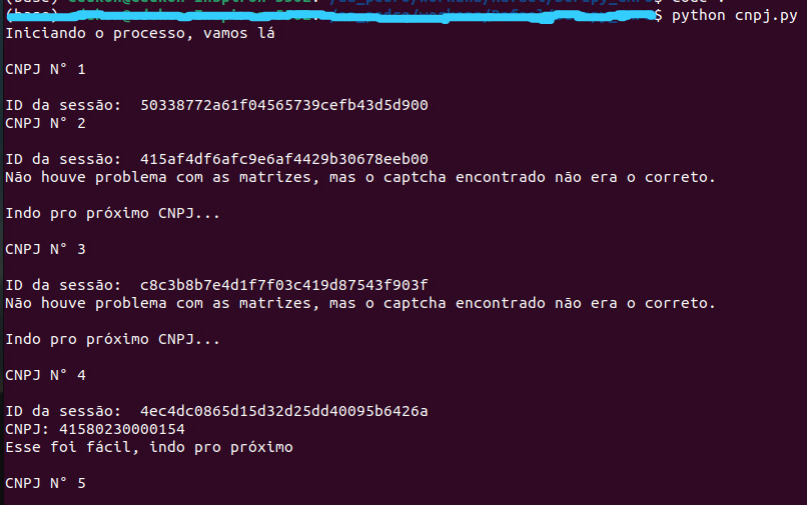

<h1>👋 Instructions</h1>

Follow the steps below to run this project in your machine.

<ul>
  <li>Clone the repository</li>
  <li>Install python or anaconda in your machine</li>
  <li>Run .py file that correspond to your Operational System: cnpj.py for Linux/iOS; cnpjWindows.py for Windows</li>
  <li>That's it!</li>
</ul>

You might see a screen like that:

<h2>Enjoy!</h2>
